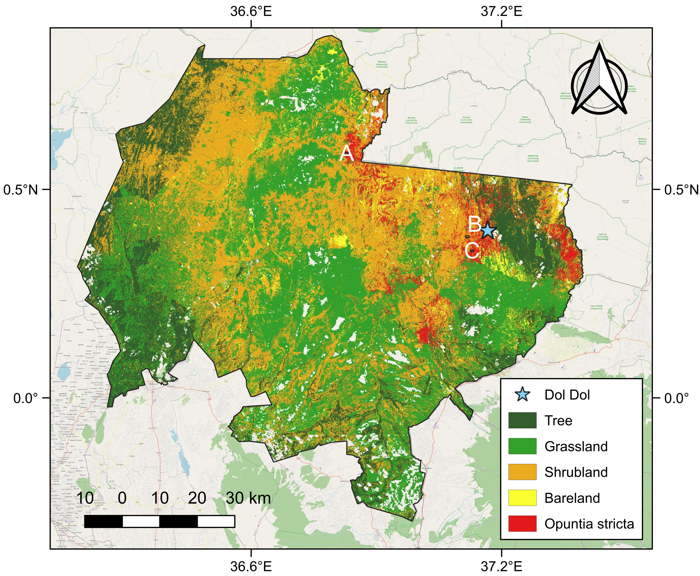

# Opuntia stricta Mapping in Laikipia, Kenya 🌵

> **How to cite**:

Song, Jiayi and Zhao, Chang and Oduor, Kenneth Tembe and Liao, Hao-Yu and Tang, Zhou and Lima Bretas, Igor and Angondalli Nagaraja, Srikantnag and Dubeux, Jose and Owino, Willis O. and Shao, Wei, Mapping Invasive Opuntia Stricta in Kenya's Drylands Using Explainable Machine Learning with Time-Series Remote Sensing and Geographic Context. Available at SSRN: https://ssrn.com/abstract=5280495 or http://dx.doi.org/10.2139/ssrn.5280495


## Overview
This repository hosts the data and code for mapping **Opuntia stricta** at 10 m spatial resolution across Laikipia County, Kenya, and interpreting drivers of its distribution using SHAP‑based Random Forest.

<p align="center">
  
</p>

### Key features
1. **Intra-annual Sentinel‑2 Time‑series** + **Climate Seasonality**  + **Geographic Context**: topography & landscape structure & anthropogenic factors  
2. **Recursive feature elimination** + **grid‑based spatial validation** + **independenct testing** to mitigate spatial autocorrelation and evaluate model robustness and spatial generalizability
3. **Explainable ML with SHAP**; dry‑season precipitation & population density emerged most influential  
4. **Hotspot & kernel density** analyses for management‐ready invasion risk products  

## Quick start

```bash
# clone
git clone https://github.com/Ecosystem-Services-GeoAI/Opuntia-Stricta-Mapping-Laikipia-Kenya.git
cd opuntia-stricta-mapping-laikipia

# create conda env
conda env create -f environment.yml
conda activate opuntia

# run the code
jupyter notebook notebooks/main.ipynb
